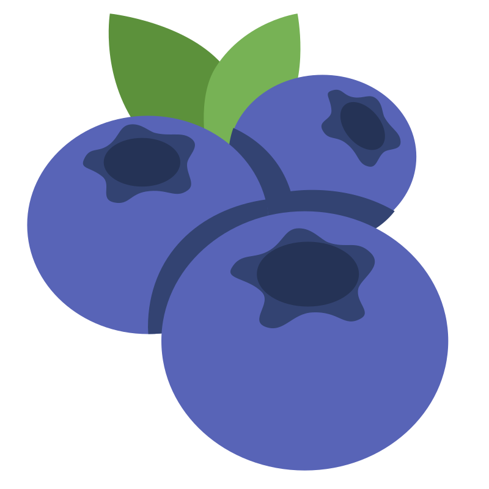

<h1> berry</h1>

A C header-only generic containers library

## Motivation

By rule 5 of Rob Pike's 5 Rules of Programming:
> Data dominates. If you've chosen the right data structures and organized things well, the algorithms will almost always be self-evident. **Data structures, not algorithms, are central to programming**.

## Features

| Abstract Data Type        | Container(s)                                                   |
| ------------------------- | -------------------------------------------------------------- |
| List                      | Dynamic Array, Linked List (Singly and Doubly)                 |
| Stack                     | Dynamic Array, Linked List (Singly)                            |
| Queue                     | Dynamic Circular Array, Linked List (Singly)                   |
| Priority Queue            | Binary Heap (Max and Min)                                      |
| Map and Set               | Hash Table (Closed Chaining and Open Addressing), Trie         |
| Ordered Map and Ordered Set | AVL Tree, Red-Black Tree, Splay Tree, In-Memory B-Tree       |
| Disjoint Set              | Forest with Path Compression and Union by Rank Heuristic       |
| Graph                     | Adjacency List, Adjacency Matrix                               |

> [!NOTE]
> Containers are not thread-safe, but future iterations of this library will likely include a few.

## Installation

### Prerequisite dependencies

- [C Compiler (C99 or later)](https://gcc.gnu.org/)
- [GNU Make](https://www.gnu.org/software/make/)
- [jemalloc](https://jemalloc.net/)
- [ClangFormat](https://clang.llvm.org/docs/ClangFormat.html)

### Static library installation

```
git clone git@github.com:simontran9/berry.git
make
```

### Dynamic library installation

## Usage

#### General structure

```
```

#### Example (`ForestDisjointSet`)

```c
```

See `docs/api.md` to learn more about the available containers and its methods.

> [!WARNING]
> I have not explicitly checked if you can use the library via the FFI, given that it is heavily designed around C macros, which don't play well with the FFI.

## Benchmarks

See `docs/benchmarks.md` for more information.

## Credits

Heavy inspiration from [Abseil containers](https://abseil.io/docs/cpp/guides/container), [Rust collections](https://doc.rust-lang.org/std/collections/index.html), and [Go containers](https://pkg.go.dev/container).